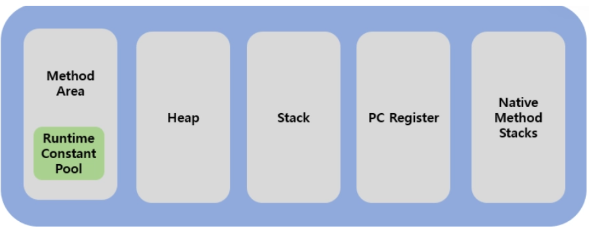
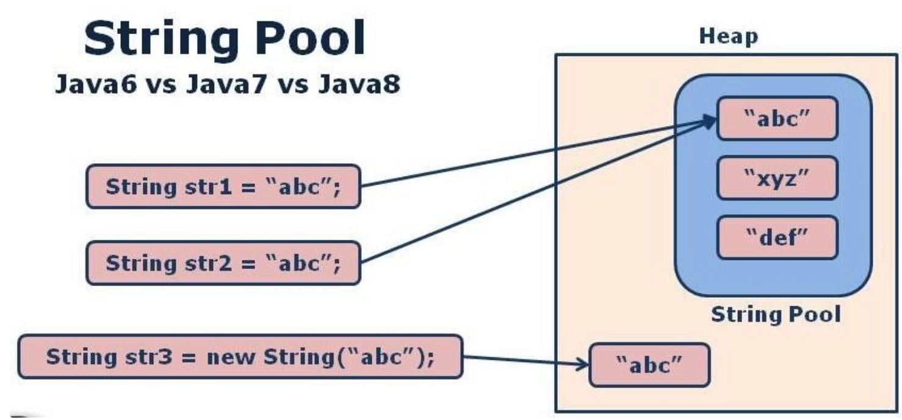

<aside>

**📖 교재 : 혼자 공부하는 자바**

# 변수(Variable)

## 1. 변수가 무엇인지

변수는 **값을 저장하기 위한 메모리 공간에 붙인 이름**이다.

프로그램이 실행되는 동안 데이터를 잠시 보관해두는 상자라고 보면 된다. 이 상자에는 이름표(변수명)가 붙어 있어서, 그 이름으로 값을 넣거나 꺼낼 수 있다.

```
[메모리]
┌──────────┐
│ age = 25 │  ← "age"라는 이름의 상자에 25라는 값이 들어있다
└──────────┘
```

핵심 포인트:

- 변수는 **하나의 값**만 저장할 수 있다 (배열/컬렉션 제외)
- 새로운 값을 넣으면 이전 값은 사라진다
- 변수를 사용하려면 반드시 **선언 → 초기화 → 사용** 순서를 거친다

---

## 2. 선언 방식

### 2.1 기본 형태

```java
타입 변수이름;           // 선언만
타입 변수이름 = 초기값;   // 선언 + 초기화
```

```java
int count;          // 선언만 (아직 값 없음)
int count = 0;      // 선언과 동시에 초기화
String name = "료헤이";  // 참조 타입 변수
```

### 2.2 타입 추론 (`var`) — Java 10+

```java
var message = "Hello";   // 컴파일러가 String으로 추론
var numbers = List.of(1, 2, 3);  // List<Integer>로 추론
```

- **지역 변수**에서만 사용 가능
- 초기값이 반드시 있어야 한다
- 가독성이 떨어지면 쓰지 않는 게 낫다

---

## 3. 활용

### 3.1 값의 저장과 변경

```java
int score = 0;
score = 100;         // 값 변경
score = score + 50;  // 기존 값을 이용한 연산
score += 50;         // 위와 동일 (축약 연산자)
```

### 3.2 상수 (변경 불가능한 변수)

```java
final int MAX_RETRY = 3;
// MAX_RETRY = 5;  // 컴파일 에러! final 변수는 재할당 불가
```

- `final`을 붙이면 한 번 초기화한 후 값을 바꿀 수 없다
- 변하지 않는 값에는 적극적으로 `final`을 사용하는 것이 좋다

### 3.4 변수 활용 예제

```java
public class VariableExample {
    public static void main(String[] args) {
        // 1. 사용자 정보 저장
        String userName = "홍길동";
        int userAge = 28;
        boolean isActive = true;

        // 2. 계산에 활용
        int birthYear = 2026 - userAge;

        // 3. 조건 분기에 활용
        if (isActive) {
            System.out.println(userName + "님은 활동 회원입니다.");
        }

        // 4. 반복문에서 카운터로 활용
        for (int i = 0; i < 5; i++) {
            System.out.println(i + "번째 반복");
        }
    }
}
```

---

## 4. 사용 범위 (Scope)

변수는 **선언된 중괄호 `{}` 블록 안에서만** 사용할 수 있다. 이것을 "스코프(scope)"라고 한다.

### 4.1 변수 종류별 스코프

```java
public class ScopeExample {

    // (1) 클래스 변수 (static 변수) — 클래스 전체에서 공유
    static int classVar = 0;

    // (2) 인스턴스 변수 — 객체마다 별도로 존재
    int instanceVar = 0;

    public void method() {
        // (3) 지역 변수 — 메서드 안에서만 유효
        int localVar = 0;

        if (localVar == 0) {
            // (4) 블록 변수 — 이 if 블록 안에서만 유효
            int blockVar = 10;
            System.out.println(blockVar); // OK
        }
        // System.out.println(blockVar); // 컴파일 에러! 스코프 밖
    }
}
```

### 4.2 정리 표

| 종류                   | 선언 위치      | 생존 기간                   | 초기값          |
| ---------------------- | -------------- | --------------------------- | --------------- |
| 클래스 변수 (`static`) | 클래스 영역    | 클래스 로딩 ~ 프로그램 종료 | 자동 초기화     |
| 인스턴스 변수          | 클래스 영역    | 객체 생성 ~ GC 수거         | 자동 초기화     |
| 지역 변수              | 메서드/블록 내 | 메서드 실행 ~ 종료          | **초기화 필수** |

> **주의**: 지역 변수만 자동 초기화가 안 된다. 초기화 없이 사용하면 컴파일 에러가 발생한다.

### 4.3 스코프 관련 흔한 실수

```java
// ❌ 잘못된 예 — 블록 밖에서 접근
for (int i = 0; i < 10; i++) {
    int sum = 0;
}
System.out.println(i);   // 컴파일 에러 — i는 for 블록 안에서만 유효
System.out.println(sum); // 컴파일 에러 — sum도 마찬가지

// ✅ 올바른 예
int sum = 0;
for (int i = 0; i < 10; i++) {
    sum += i;
}
System.out.println(sum); // OK
```

---

## 5. 관례 (Naming Convention)

Java 커뮤니티에서 사실상 표준으로 통용되는 네이밍 규칙이다.

### 5.1 변수명 규칙

| 규칙                        | 좋은 예                       | 나쁜 예                 |
| --------------------------- | ----------------------------- | ----------------------- |
| camelCase 사용              | `userName`, `totalCount`      | `user_name`, `UserName` |
| 의미 있는 이름              | `retryCount`                  | `rc`, `x`, `temp`       |
| boolean은 is/has/can 접두어 | `isActive`, `hasPermission`   | `active`, `check`       |
| 상수는 UPPER_SNAKE_CASE     | `MAX_SIZE`, `DEFAULT_TIMEOUT` | `maxSize`, `MaxSize`    |
| 약어 남용 금지              | `customerId`                  | `custId`, `cId`         |

- 네이밍 표기법
  - **카멜 케이스 (camelCase):** 첫 단어는 소문자, 이어지는 단어의 첫 글자는 대문자로 표기 (예: `userName`, `totalPrice`). Java, JavaScript 변수명에 주로 사용.
  - **파스칼 케이스 (PascalCase):** 모든 단어의 첫 글자를 대문자로 표기 (예: `ClassName`, `UserProfile`). 주로 클래스나 생성자 함수명에 사용.
  - **스네이크 케이스 (snake_case):** 모든 단어를 소문자로 표기하고 언더바(`_`)로 연결 (예: `user_name`, `api_key`). Python, C언어 등에서 변수/함수명에 주로 사용.
  - **케밥 케이스 (kebab-case):** 모든 단어를 소문자로 표기하고 하이픈()으로 연결 (예: `css-class`, `font-size`). URL이나 CSS 클래스명에 주로 사용.
    [티스토리](data:image/png;base64,iVBORw0KGgoAAAANSUhEUgAAAIAAAACACAMAAAD04JH5AAAALVBMVEVHcEz/Wkr/W0v/Wkr/XUz/W0r/Wkr/////U0H/19P/opr/wbv/c2b/7+3/hntmB7GqAAAABnRSTlMA10exG4NKq0l7AAAELUlEQVR4nNVbWbKEIAxU3MDt/sd96CgQRJYApl5/TVEW3ZOEJCI0DQJ9z9jQdV3bjuPYtq38OTDW95i50skl9Un8gBQysLoiJLmTGsioJyKCXWkoz97Hst8aypqBdSnsP3TlzIChLyiBJdkeos2X0CP/vbJCZiykhZ7TCEMGfY71DQloPwwl6A/gjJDrfROYSChjfoVkNxQz/41ENxQ0/42OmD9FQV/W/QptZCjW4o9VUI8/UkFFfqkgzF8l/jSCkViZP6igeP55wpuRWH1+b1auuQAMvC+Fb/jfw+CDAPjhJQw+CYAf3GHwkQMOOPPRZw444HDCRyvggqMoVE+BEI+V8GEE/mDH4acOONASG8A2QTAC+AH36MtwaMYuxQB8nZdlmVc4Kx93OTzvI494+AkWbwA+b9OBbYZE4hydBORSDwcUGCboA/zLdEMYw6sanXbNxYUaXfzTGlXRnwT5rJmmRVGtmx7dVofYaZrdE97Q6dC7BrnJNG33nwVM6s/yHTy8vs56QK1EfwgCAxgmMJmmzWUAaQJ/GLA4D8A57yhYweh0/VcjAqDDnBiiypA15yWA71DA7RnrYb+AqyQFPOAWYFsAJeDyQaAReIsBKOB+OCkGLh+E6hD8r2rJO1fBCD3jXwXXOghkIYtKZSIYBDoTmT4IZaJfLooohHrSTQ+arjFNrZeneM5kg4VDACgAWf+uEDDrqwoh+YMV8QyCqF5sX7ZpEzsclGVPHPR23duFfHixHnaji21Gubvy+0bDf388M0FsN8ydBpWjjmH3sy8CCJoxE4xewKcvRE8MX7+Q2OhyBcQFey0BfFz3fY0OebeAjFcifmQcmZ9CNc+HNkeAKlLhouMRUIA/SwFaAOxT8F7AWwA0XxGV900AMga4uytOBjoI37rifygAm4gKuSAjE5YJQryAQsuwyyjHooABZDnOaEiE5kfnobyO6OrL54x6yLK2aLlszGVTnlMM47viNwl5Hcnxgk7ak3WRr2bVMNDs0mqwqNfziuhJNso12pgtGh+OJZCzDIa8rXo+zosQS0YeYjHbdO/8+71ZjW4G+piNynf+7Hbk3izG+QBuVqMUqC8GKB+4t+lSoD8boXwANqun8PNP6O16TC4q0BMaHy/TC1KBrtj8aoUIQ9sC6QLAdztETc6NAfjxFmGC3FVgfbtNXong69CWHgL2EYJ0E5hhiHgteByiQCwE52Z1JJ4HWRAlifNZSMyIguw61YZIhxzdDzjP0aAqAq4Mug/VkR/jIT/I9Nk7yvuJvm+O8vjOdVIf56M/0Eh/pJP+UCv9sV76g83kR7vpD7c35Mf76yhI4qe/4lH6kgvmrhH2ipuTH3fhi/iiU0N/1ashv+zW0F/3a8gvPJ4SaK98YiUUpD9AfO33BO3F5xPEV7+VCLrL70qEef1/zLv+/wc6iTUbMyEBDwAAAABJRU5ErkJggg==)

### 5.2 실무에서 자주 보는 패턴

```java
// 컬렉션은 복수형
List<String> userNames = new ArrayList<>();
Map<String, Integer> scoreMap = new HashMap<>();

// 임시 변수라도 의미를 담는다
for (User user : users) {        // ✅ 요소의 의미가 드러남
    // ...
}
for (User u : users) {           // ⚠️ 짧은 블록이면 허용되지만 권장하지 않음
    // ...
}

// boolean 변수
boolean isDeleted = false;
boolean hasNext = iterator.hasNext();
```

### 5.3 하지 말아야 할 것

```java
int a, b, c, d;          // 의미 불명
String data;              // 너무 모호함
String data2;             // 숫자 접미사 — 설계를 다시 생각할 것
int aaaa;                 // 논외
Object temp;              // 임시라도 역할 이름을 붙여라
```

---

## 참고: 변수 선언 위치에 대한 실무 관점

변수는 **사용하는 곳에 최대한 가까이** 선언하는 것이 좋다.

```java
// ❌ 메서드 상단에 몰아서 선언 (C 스타일)
public void process() {
    int count;
    String name;
    boolean flag;
    // ... 50줄 뒤에 비로소 사용

// ✅ 사용 직전에 선언
public void process() {
    // ... 어떤 로직
    int count = calculateCount();  // 필요한 시점에 선언
    // count 사용
}
```

> 변수의 스코프가 좁을수록 코드를 읽고 유지보수하기 쉽다.

<br>

# 기본 타입 (Primitive Type)

```java
- 기본타입 종류와 간단 개념
- 정수 타입
- char 타입
- String 타입
- 실수 타입 + 부동소수점 오차
- boolean 타입
```

## 1. 기본 타입 종류와 간단 개념

Java의 데이터 타입은 크게 **기본 타입(Primitive Type)**과 **참조 타입(Reference Type)**으로 나뉜다.

기본 타입은 **값 자체를 메모리에 직접 저장**하는 타입이다. 총 8개가 존재하며, 이것이 Java가 제공하는 가장 작은 데이터 단위다.

```
기본 타입 (8개)
├── 정수형: byte, short, int, long
├── 실수형: float, double
├── 문자형: char
└── 논리형: boolean
```

- 기본 타입 vs 참조 타입의 핵심 차이:
  | | 기본 타입 | 참조 타입 |
  | -------------- | ------------- | ---------------------- |
  | 저장하는 것 | 값 그 자체 | 객체의 메모리 주소 |
  | 메모리 위치 | 스택(Stack) | 힙(Heap)의 객체를 참조 |
  | null 가능 여부 | 불가 | 가능 |
  | 예시 | `int a = 10;` | `String s = "hello";` |

> **왜 기본 타입이 존재하는가?** 성능이다. 객체를 만들면 힙에 할당하고 GC가 관리해야 하지만, 기본 타입은 스택에 바로 값을 넣으므로 빠르고 가볍다.

---

## 2. 정수 타입

### 2.1 4가지 정수 타입

| 타입    | 크기    | 범위              | 용도                      |
| ------- | ------- | ----------------- | ------------------------- |
| `byte`  | 1바이트 | -128 ~ 127        | 바이너리 데이터, 파일 I/O |
| `short` | 2바이트 | -32,768 ~ 32,767  | 거의 안 씀                |
| `int`   | 4바이트 | 약 -21억 ~ 21억   | **기본 정수 타입**        |
| `long`  | 8바이트 | 약 -922경 ~ 922경 | 큰 숫자 (타임스탬프 등)   |

```java
int population = 51_000_000;         // 언더스코어로 자릿수 구분 가능 (Java 7+)
long worldPopulation = 8_000_000_000L; // int 범위 초과 → long 필수, 접미사 L
```

### 2.2 리터럴 표현

> 리터럴(Literal)은 **프로그래밍 언어에서 소스 코드상에 직접 기술된 고정된 값 그 자체**

```java
int decimal = 100;       // 10진수
int binary = 0b1100100;  // 2진수 (0b 접두사)
int octal = 0144;        // 8진수 (0 접두사)
int hex = 0x64;          // 16진수 (0x 접두사)
// 위 네 변수 모두 값은 100
```

### 2.3 오버플로우 — 정수 타입의 함정

정수 타입은 표현 범위를 넘어가면 **조용히 값이 뒤집힌다.** 에러가 나지 않기 때문에 더 위험하다.

```java
int max = Integer.MAX_VALUE;  // 2,147,483,647
int overflow = max + 1;       // -2,147,483,648 ← 양수가 음수로!
System.out.println(overflow); // -2147483648

// 실무에서 이런 버그를 만나면 찾기 매우 어렵다
// But, IDE단에서 표시 및 조치를 도와줘서 실수할 가능성이 낮다.
```

---

## 3. char 타입

`char`는 **하나의 문자를 저장하는 2바이트 정수 타입**이다. 내부적으로 유니코드(UTF-16) 코드값을 저장한다.

```java
char letter = 'A';       // 문자 리터럴 (작은따옴표)
char unicode = '\uAC00'; // 유니코드 리터럴 → '가'
char number = 65;        // 정수 대입 → 'A' (유니코드 65번)
```

### char는 사실 정수다

```java
char ch = 'A';
int code = ch;            // 65
char next = (char)(ch + 1); // 'B'

// 이런 성질을 이용한 알파벳 순회
for (char c = 'A'; c <= 'Z'; c++) {
    System.out.print(c + " ");
}
// A B C D E F G H I J K L M N O P Q R S T U V W X Y Z
```

### 주의: char vs String

```java
char c = 'A';     // 작은따옴표 — 문자 하나
String s = "A";   // 큰따옴표 — 문자열 객체

// char는 기본 타입, String은 참조 타입
// 완전히 다른 것이다
```

> **실무 관점**: `char`를 직접 다루는 일은 드물다. 대부분 `String`으로 처리한다. 알고리즘 문제나 파서 작성 시 가끔 쓰인다.

---

## 4. String 타입

`String`은 기본 타입이 아니라 **참조 타입(클래스)**이다. 하지만 워낙 자주 쓰이기 때문에 기본 타입처럼 리터럴 문법을 지원한다.

### 4.1 기본 사용

```java
// 리터럴 방식 (권장)
String name = "홍길동";

// new 방식 (비권장 — 불필요한 객체 생성)
String name2 = new String("홍길동");
```

- 상수 풀(Constant Pool)과 Heap

  ### JVM 메모리 구조 모식도

  
  - **Method Area (정적 영역):** 클래스 정보, 변수 이름, 메서드 데이터, **Static 변수**가 저장됩니다. (모든 스레드 공유)
  - **Heap (힙 영역):** `new` 키워드로 생성된 **모든 객체**와 **배열**이 저장됩니다. Garbage Collector(GC)의 주요 대상입니다. (모든 스레드 공유)
  - **Stack (스택 영역):** 메서드 호출 시 생성되는 **지역 변수**와 **매개변수**가 저장됩니다. 실제 객체는 힙에 있고, 스택의 변수는 그 객체의 **주소값**을 가집니다. (스레드별 독립 존재)
  - **PC Register / Native Method Stack:** 스레드 실행 주소 및 C/C++ 코드 실행을 위한 공간입니다.
    > `String`은 객체임에도 불구하고 워낙 자주 쓰이기 때문에, 자바는 메모리 효율을 위해 **String Constant Pool**이라는 특별한 관리 구역을 Method Area에 배치.
    > ※Java 7부터는 Heap으로 위치 변경
    > 

  ### Question

  ```java
  String a = "a";
  String b = "a";
  String c = new String("a");

  System.out.println(a == b); //?
  System.out.println(a == c); //?
  ```

### 4.2 String의 핵심 특성: 불변(Immutable)

String 객체는 한 번 생성되면 **내부 값을 변경할 수 없다.**

```java
String original = "Hello";
original.replace("H", "h"); // "hello"를 반환하지만...
System.out.println(original); // "Hello" — 원본은 그대로!

// 반환값을 받아야 한다
String modified = original.replace("H", "h");
System.out.println(modified); // "hello"
```

### 4.3 문자열 비교: `==` vs `equals()`

```java
String a = "hello";
String b = "hello";
String c = new String("hello");

System.out.println(a == b);      // true  — 같은 리터럴 풀 참조
System.out.println(a == c);      // false — 다른 객체
System.out.println(a.equals(c)); // true  — 값이 같음
```

```
[String Pool]         [Heap]
┌─────────┐          ┌─────────┐
│ "hello" │ ← a, b   │ "hello" │ ← c (별도 객체)
└─────────┘          └─────────┘
```

> **원칙**: 문자열 비교는 **항상 `equals()`**를 사용한다. `==`는 주소 비교이므로 의도치 않은 버그의 원인이 된다.

- **자주 쓰는 String Method**

  ```java
  String text = "Hello, World!";

  text.length();              // 13
  text.charAt(0);             // 'H'
  text.substring(0, 5);       // "Hello"
  text.contains("World");     // true
  text.indexOf("World");      // 7
  text.toUpperCase();         // "HELLO, WORLD!"
  text.trim();                // 앞뒤 공백 제거
  text.isEmpty();             // false
  text.isBlank();             // false (Java 11+, 공백만 있어도 true)
  text.split(", ");           // ["Hello", "World!"]
  ```

### 4.4 문자열 연결

```java
// + 연산자 (간단할 때)
String greeting = "Hello" + " " + "World";

// StringBuilder (반복문 안에서 문자열 합칠 때 필수)
StringBuilder sb = new StringBuilder();
for (int i = 0; i < 100; i++) {
    sb.append("item").append(i).append(", ");
}
String result = sb.toString();

// ❌ 변수와 결합 시 상수풀이 아닌 불필요한 Heap 객체 생성
String result = "";
for (int i = 0; i < 100; i++) {
    result += "A"; // 반복할 때마다 새로운 객체가 힙에 생성됨
}
```

> **왜 StringBuilder를 쓰는가?** String은 불변이므로 `+`로 합칠 때마다 새 객체가 생긴다. 반복문 안에서 `+`를 쓰면 수백 개의 쓸모없는 객체가 만들어져 성능이 급격히 떨어진다.

---

## 5. 실수 타입 + 부동소수점 오차

### 5.1 두 가지 실수 타입

| 타입     | 크기    | 유효 자릿수 | 비고               |
| -------- | ------- | ----------- | ------------------ |
| `float`  | 4바이트 | 약 7자리    | 접미사 `f` 필수    |
| `double` | 8바이트 | 약 15자리   | **기본 실수 타입** |

```java
float pi1 = 3.14f;    // f 접미사 필수
double pi2 = 3.14;    // 실수 리터럴의 기본은 double
```

### 5.2 부동소수점이란?

컴퓨터는 실수를 **IEEE 754** 표준에 따라 2진수로 저장한다. 소수점이 "떠다닌다(floating)"는 뜻에서 부동소수점이라 부른다.

```
double 3.14의 내부 구조 (64비트):
┌───────┬────────────┬─────────────────────────────────────┐
│ 부호  │   지수부   │               가수부                 │
│ 1비트 │  11비트    │             52비트                   │
└───────┴────────────┴─────────────────────────────────────┘
```

### 5.3 부동소수점 오차 — 반드시 알아야 하는 문제

10진수 0.1은 2진수로 **정확하게 표현할 수 없다.** 무한소수가 되기 때문이다.

```java
double a = 0.1;
double b = 0.2;
double result = a + b;

System.out.println(result);         // 0.30000000000000004
System.out.println(result == 0.3);  // false!
```

이것은 버그가 아니라 **부동소수점의 본질적 한계**다. 10진수에서 1/3이 0.3333...인 것처럼, 2진수에서 0.1이 무한소수가 된다.

### 5.4 실수 비교는 어떻게?

```java
// 방법 1: 오차 허용 범위(epsilon) 비교
double epsilon = 1e-10;
if (Math.abs(a + b - 0.3) < epsilon) {
    System.out.println("같다고 판단");
}

// 방법 2: BigDecimal 사용 (정밀 계산이 필요할 때)
import java.math.BigDecimal;

BigDecimal x = new BigDecimal("0.1");  // 문자열로 생성해야 정확!
BigDecimal y = new BigDecimal("0.2");
BigDecimal sum = x.add(y);

System.out.println(sum);                           // 0.3
System.out.println(sum.equals(new BigDecimal("0.3"))); // true
```

### 5.5 BigDecimal 주의사항

```java
// ❌ double로 생성하면 오차가 그대로 들어온다
BigDecimal bad = new BigDecimal(0.1);
System.out.println(bad); // 0.1000000000000000055511151231257827021181583404541015625

// ✅ 문자열로 생성
BigDecimal good = new BigDecimal("0.1");
System.out.println(good); // 0.1
```

> **실무 원칙**: 돈 계산, 세금, 이자율 등 정확한 소수 계산이 필요한 곳에서는 **`double`을 절대 쓰지 않고 `BigDecimal`을 사용**한다.

---

## 6. boolean 타입

`boolean`은 `true` 또는 `false` **두 가지 값만** 가질 수 있는 타입이다.

### 6.1 기본 사용

```java
boolean isRunning = true;
boolean hasPermission = false;

// 조건문에서 사용
if (isRunning) {
    System.out.println("실행 중");
}

// 비교 연산의 결과도 boolean
boolean isAdult = (age >= 18);
```

### 6.2 주의: Java의 boolean은 정수가 아니다

C/C++과 달리 Java에서는 **0과 1을 boolean으로 쓸 수 없다.**

```java
// ❌ Java에서는 컴파일 에러
if (1) { ... }
int flag = 0;
if (flag) { ... }

// ✅ 명시적으로 boolean 표현
if (true) { ... }
if (flag != 0) { ... }
```

### 6.3 boolean 네이밍과 활용

```java
// 상태 표현
boolean isConnected = checkConnection();
boolean hasError = (errorCount > 0);
boolean canProceed = isConnected && !hasError;

// 메서드 반환 타입으로 활용
public boolean isEmpty() {
    return size == 0;
}

// 삼항 연산자와 함께
String status = isActive ? "활성" : "비활성";
```

---

## 요약: 타입 선택 가이드

```
정수가 필요하다
  └→ 대부분 int
  └→ 21억 넘으면 long

실수가 필요하다
  └→ 일반 계산: double
  └→ 돈/정밀 계산: BigDecimal

문자가 필요하다
  └→ 문자열: String (거의 대부분)
  └→ 문자 하나: char (드묾)

참/거짓이 필요하다
  └→ boolean
```

### 부록 : Java의 데이터 타입 분류

| 분류       | 타입                      | 크기    | 예시                       |
| ---------- | ------------------------- | ------- | -------------------------- |
| **정수형** | `byte`                    | 1바이트 | `byte b = 127;`            |
|            | `short`                   | 2바이트 | `short s = 32000;`         |
|            | `int`                     | 4바이트 | `int i = 2_100_000_000;`   |
|            | `long`                    | 8바이트 | `long l = 9_000_000_000L;` |
| **실수형** | `float`                   | 4바이트 | `float f = 3.14f;`         |
|            | `double`                  | 8바이트 | `double d = 3.14;`         |
| **문자형** | `char`                    | 2바이트 | `char c = 'A';`            |
| **논리형** | `boolean`                 | 1바이트 | `boolean flag = true;`     |
| **참조형** | `String`, 배열, 클래스 등 | 가변    | `String s = "hello";`      |

> **실무 팁**: 실수형은 금액 계산에 쓰지 않는다. 부동소수점 오차 때문에 `BigDecimal`을 쓴다.

## 변수와 시스템 입출력

## Part 1. 핵심만 기억하자 (입문자용)

---

## 1. 출력 — 화면에 결과 보여주기

프로그램이 계산한 결과를 사람이 보려면 **출력**이 필요하다. Java에서는 `System.out`을 쓴다.

### 1.1 세 가지 출력 메서드

```java
System.out.println("Hello");  // 출력 후 줄바꿈
System.out.print("Hello");    // 출력 후 줄바꿈 안 함
System.out.printf("%s는 %d살입니다", "홍길동", 25); // 형식 지정 출력
```

**이것만 기억하자:**

- `println` = print + **l**ine (줄바꿈 O) → **가장 많이 쓴다**
- `print` = 줄바꿈 없이 이어서 출력
- `printf` = 형식을 지정해서 출력

### 1.2 println으로 변수 출력하기

```java
String name = "홍길동";
int age = 25;

// 문자열 + 변수 연결
System.out.println("이름: " + name);           // 이름: 홍길동
System.out.println("나이: " + age + "살");      // 나이: 25살
System.out.println(name + "은 " + age + "살"); // 홍길동은 25살
```

> `+` 연산자로 문자열과 변수를 이어 붙일 수 있다. 숫자도 문자열과 `+`하면 자동으로 문자열이 된다.

### 1.3 printf 형식 지정자 (자주 쓰는 것만)

```java
String name = "홍길동";
int score = 95;
double rate = 3.141592;

System.out.printf("이름: %s\n", name);      // 이름: 홍길동
System.out.printf("점수: %d점\n", score);    // 점수: 95점
System.out.printf("원주율: %.2f\n", rate);   // 원주율: 3.14
```

| 형식 지정자 | 의미             | 예시       |
| ----------- | ---------------- | ---------- |
| `%s`        | 문자열 (String)  | `"홍길동"` |
| `%d`        | 정수 (Decimal)   | `95`       |
| `%f`        | 실수 (Float)     | `3.141592` |
| `%.2f`      | 소수점 2자리     | `3.14`     |
| `%n`        | 줄바꿈 (OS 호환) | —          |

> **입문자 팁**: 처음에는 `println`과 `+` 연결만 써도 충분하다. `printf`는 소수점 자릿수 맞출 때 쓰면 된다.

---

## 2. 입력 — 사용자에게 값 받기

프로그램이 사용자의 입력을 받으려면 `Scanner`를 사용한다.

### 2.1 Scanner 기본 사용법

```java
import java.util.Scanner;  // ① import 필수

public class InputExample {
    public static void main(String[] args) {
        Scanner scanner = new Scanner(System.in);  // ② Scanner 생성

        System.out.print("이름을 입력하세요: ");
        String name = scanner.nextLine();          // ③ 한 줄 입력 받기

        System.out.print("나이를 입력하세요: ");
        int age = scanner.nextInt();               // ④ 정수 입력 받기

        System.out.println(name + "님은 " + age + "살입니다.");

        scanner.close();                           // ⑤ 사용 후 닫기
    }
}
```

- 상단 import
  단순히 특정 클래스의 이름을 앞으로 줄여서 부르겠다고 선언하는 구문.
- TMI: 라이브러리 구조
  `상단의 java.util은 라이브러리다`.
  라이브러리에는 두가지 종류가 있음.
  - JDK 표준 라이브러리
  - 외부 라이브러리 (직접 개발도 포함)
    라이브러리는 .jar로 구성되어 있고, jar의 위치를 클래스패스(Classpath)라는 사전과 같은 공간에 저장 → import 구문을 통해 사용
    import에서 오류가 발생한다면 클래스패스에 해당 .jar의 위치가 없다는 것을 의미.

### 2.2 타입별 입력 메서드

| 메서드          | 읽는 것             | 예시 입력       |
| --------------- | ------------------- | --------------- |
| `nextLine()`    | 한 줄 전체          | `"Hello World"` |
| `next()`        | 공백 전까지 한 단어 | `"Hello"`       |
| `nextInt()`     | 정수                | `42`            |
| `nextDouble()`  | 실수                | `3.14`          |
| `nextBoolean()` | true/false          | `true`          |

## 3. 입출력 조합 예제

```java
import java.util.Scanner;

public class SimpleCalculator {
    public static void main(String[] args) {
        Scanner scanner = new Scanner(System.in);

        System.out.print("첫 번째 숫자: ");
        int a = scanner.nextInt();

        System.out.print("두 번째 숫자: ");
        int b = scanner.nextInt();

        System.out.println("덧셈: " + (a + b));
        System.out.println("뺄셈: " + (a - b));
        System.out.printf("나눗셈: %.2f%n", (double) a / b);

        scanner.close();
    }
}
```

## 4. System.out의 정체

`System.out.println()`을 매일 쓰지만, 이 한 줄에 생각보다 많은 것이 숨어 있다.

### 4.1 분해해 보기

```java
System.out.println("Hello");
```

| 요소        | 정체                      | 설명                                         |
| ----------- | ------------------------- | -------------------------------------------- |
| `System`    | `java.lang.System` 클래스 | JVM과 시스템 자원을 연결하는 유틸리티 클래스 |
| `out`       | `static PrintStream` 필드 | 표준 출력 스트림 (stdout)                    |
| `println()` | `PrintStream`의 메서드    | 데이터를 출력하고 줄바꿈                     |

```java
// System 클래스 내부 (실제 소스 발췌 형태)
public final class System {
    public static final PrintStream out = ...;  // 표준 출력
    public static final PrintStream err = ...;  // 표준 에러 출력
    public static final InputStream in = ...;   // 표준 입력
}
```

즉 `System.out`은 **`PrintStream` 타입의 static 객체**이고, `PrintStream`은 `OutputStream`을 상속한 클래스다.

### 4.2 System.err — 에러 출력

```java
System.out.println("정상 메시지");   // stdout → 표준 출력
System.err.println("에러 메시지");   // stderr → 표준 에러 출력
```

- 둘 다 콘솔에 출력되지만 **별도의 스트림**이다
- IDE에서는 보통 err 출력이 빨간색으로 표시된다
- 리다이렉션 시 분리 가능: `java App > output.txt 2> error.txt`

### 4.3 System.in의 정체와 한계

```java
// System.in은 InputStream — 바이트 단위로만 읽는다
int data = System.in.read();  // 1바이트 읽기 (ASCII 코드 반환)
```

`System.in`은 `InputStream`이라서 **바이트 단위 읽기만 가능**하다. 문자열이나 정수를 직접 읽을 수 없기 때문에 `Scanner`나 `BufferedReader` 같은 래퍼가 필요한 것이다.

---

## 5. Scanner 너머의 선택지

### 5.1 BufferedReader — 성능이 중요할 때

```java
import java.io.BufferedReader;
import java.io.InputStreamReader;
import java.io.IOException;

public class FastInput {
    public static void main(String[] args) throws IOException {
        BufferedReader br = new BufferedReader(new InputStreamReader(System.in));

        String line = br.readLine();        // 한 줄 읽기
        int number = Integer.parseInt(line); // 직접 파싱 필요

        br.close();
    }
}
```

**Scanner vs BufferedReader:**

| 항목   | Scanner                           | BufferedReader                |
| ------ | --------------------------------- | ----------------------------- |
| 편의성 | `nextInt()` 등 타입별 메서드 제공 | `readLine()`만 → 직접 파싱    |
| 성능   | 느림 (정규식 기반 파싱)           | 빠름 (버퍼링 + 단순 읽기)     |
| 용도   | 학습, 일반 프로그램               | 알고리즘 대회, 대량 입력 처리 |

> **실무에서는?** 콘솔 입력 자체를 거의 안 쓴다. 웹 애플리케이션은 HTTP 요청으로 데이터를 받고, 배치 프로그램은 파일이나 DB에서 읽는다. Scanner/BufferedReader는 학습과 코딩 테스트용이라고 보면 된다.

### 5.2 출력 성능: println vs BufferedWriter

```java
// 반복문에서 대량 출력 시
// ❌ 느림 — println은 매번 flush
for (int i = 0; i < 100_000; i++) {
    System.out.println(i);
}

// ✅ 빠름 — 버퍼에 모아서 한 번에 출력
StringBuilder sb = new StringBuilder();
for (int i = 0; i < 100_000; i++) {
    sb.append(i).append('\n');
}
System.out.print(sb);
```

알고리즘 대회에서 시간 초과의 원인이 `println` 반복인 경우가 꽤 있다.

---

## 7. 문자 인코딩과 입출력

### 7.1 한글이 깨지는 이유

```java
// 시스템 기본 인코딩 확인
System.out.println(System.getProperty("file.encoding")); // UTF-8 또는 MS949
```

Windows에서 Java를 실행하면 콘솔 인코딩이 `MS949`(EUC-KR 계열)이고, 소스 파일이 `UTF-8`인 경우 한글이 깨질 수 있다.

```bash
# 실행 시 인코딩 지정
java -Dfile.encoding=UTF-8 MyApp

# JDK 18부터는 UTF-8이 기본값이 되어 이 문제가 줄어들었다
```

---

## 연산자와 연산식

## 1. 연산자 종류와 개념

연산자(Operator)는 **값을 계산하거나 비교하거나 조합하는 기호**다.

### 1.1 한눈에 보기

| 분류               | 연산자                         | 하는 일                   | 예시                      |
| ------------------ | ------------------------------ | ------------------------- | ------------------------- |
| **산술**           | `+` `-` `*` `/` `%`            | 사칙연산, 나머지          | `10 % 3` → `1`            |
| **비교**           | `==` `!=` `>` `<` `>=` `<=`    | 두 값 비교 → boolean 반환 | `a >= 10`                 |
| **논리**           | `&&` \|\| `!`                  | 조건 조합                 | `a > 0 && b > 0`          |
| **대입**           | `=` `+=` `-=` `*=` `/=` `%=`   | 값 저장 / 복합 대입       | `count += 1`              |
| **증감**           | `++` `--`                      | 1 증가 / 1 감소           | `i++`                     |
| **~~삼항~~**       | `? :`                          | 조건에 따라 값 선택       | `x > 0 ? "양수" : "음수"` |
| **~~비트~~**       | `&` \| `^` `~` `<<` `>>` `>>>` | 비트 단위 연산            | `flags & 0xFF`            |
| **~~instanceof~~** | `instanceof`                   | 타입 확인                 | `obj instanceof String`   |

---

### 1.2 산술 연산자 주의사항

**정수 나눗셈은 소수점을 버린다.**

```java
int result = 7 / 2;    // 3 (3.5가 아니다!)
double result2 = 7 / 2; // 3.0 (int끼리 나눈 후 double에 담은 것뿐)

// 소수점이 필요하면 한쪽을 double로
double result3 = 7.0 / 2;    // 3.5
double result4 = (double) 7 / 2; // 3.5
```

**0으로 나누기**

```java
int x = 10 / 0;     // ArithmeticException — 프로그램 터짐
double y = 10.0 / 0; // Infinity — 에러 안 남! (IEEE 754 규약)
double z = 0.0 / 0;  // NaN (Not a Number)
```

> **실무 팁**: 나눗셈 전에 분모가 0인지 반드시 체크하는 습관을 들여라. 실수 타입의 `Infinity`, `NaN`은 에러 없이 조용히 퍼져나가서 더 위험하다.

**나머지 연산자 `%` 활용**

```java
// 짝수/홀수 판별
if (number % 2 == 0) { /* 짝수 */ }

// 배수 판별
if (count % 5 == 0) { /* 5의 배수마다 실행 */ }
```

---

### 1.3 비교 연산자 주의사항

**`==`는 기본 타입에서만 값 비교다.**

```java
// 기본 타입 → 값 비교 (OK)
int a = 10;
int b = 10;
System.out.println(a == b); // true

// 참조 타입 → 주소 비교 (함정!)
String s1 = new String("hello");
String s2 = new String("hello");
System.out.println(s1 == s2);      // false — 다른 객체
System.out.println(s1.equals(s2)); // true  — 값이 같음
```

> **원칙**: 객체 비교는 `equals()`, 기본 타입 비교는 `==`.

---

### 1.4 논리 연산자 — 단축 평가(Short-circuit Evaluation)

`&&`와 `||`는 **왼쪽만으로 결과가 확정되면 오른쪽을 실행하지 않는다.**

```java
// && — 왼쪽이 false면 오른쪽 실행 안 함
if (list != null && list.size() > 0) {
    // list가 null이면 size()를 호출하지 않아서 NullPointerException 방지
}

// || — 왼쪽이 true면 오른쪽 실행 안 함
if (cached != null || (cached = loadFromDB()) != null) {
    // 캐시가 있으면 DB 조회 안 함
}
```

> **실무 팁**: null 체크를 `&&` 왼쪽에 두는 건 Java 관용 패턴이다. 순서를 바꾸면 NullPointerException이 터진다.

---

### 1.5 증감 연산자 — 전위 vs 후위

```java
int a = 5;
int b = a++;  // b = 5, a = 6 (대입 먼저, 증가 나중)
int c = ++a;  // c = 7, a = 7 (증가 먼저, 대입 나중)
```

> **실무 팁**: 증감 연산자를 다른 연산과 섞어 쓰면 읽기 어려운 코드가 된다. **단독으로 `i++` 한 줄로 쓰는 게 가장 안전하다.** `a = b++ + ++c` 같은 코드는 쓰지 마라.

---

### 1.6 삼항 연산자

```java
// 간단한 분기에 유용
String status = isActive ? "활성" : "비활성";
int max = (a > b) ? a : b;
```

> **실무 팁**: 삼항 연산자를 중첩하면 가독성이 급격히 떨어진다. 한 단계까지만 쓰고, 그 이상은 `if-else`로 풀어라.

```java
// ❌ 읽기 어려움
String grade = score >= 90 ? "A" : score >= 80 ? "B" : score >= 70 ? "C" : "F";

// ✅ if-else가 낫다
String grade;
if (score >= 90) grade = "A";
else if (score >= 80) grade = "B";
else if (score >= 70) grade = "C";
else grade = "F";
```

---

## 2. 피연산자 (Operand)

피연산자는 **연산자가 계산에 사용하는 대상(값)**이다.

```java
int result = 10 + 20;
//           ──   ──
//         피연산자1  피연산자2
//              ─
//            연산자
```

연산자는 피연산자 개수에 따라 분류된다:

| 분류        | 피연산자 수 | 예시                 |
| ----------- | ----------- | -------------------- |
| 단항 연산자 | 1개         | `++a`, `-x`, `!flag` |
| 이항 연산자 | 2개         | `a + b`, `x == y`    |
| 삼항 연산자 | 3개         | `조건 ? 값1 : 값2`   |

### 피연산자의 자동 타입 승격 (Promotion)

연산 시 타입이 다르면 **큰 타입으로 자동 변환**된다. 이걸 모르면 의도치 않은 결과가 나온다.

```java
// int + double → double로 승격
int a = 10;
double b = 3.0;
double result = a + b; // 13.0 (a가 10.0으로 승격)

// byte, short, char는 연산 시 int로 승격
byte x = 10;
byte y = 20;
// byte sum = x + y;  // 컴파일 에러! x + y의 결과는 int
int sum = x + y;       // OK

// 문자열 + 다른 타입 → 문자열 연결
System.out.println("점수: " + 100);       // "점수: 100"
System.out.println(1 + 2 + "번");         // "3번" (왼쪽부터 계산)
System.out.println("번호" + 1 + 2);       // "번호12" (문자열 연결이 먼저)
```

> **주의**: `"번호" + 1 + 2`가 `"번호12"`가 되는 건 **왼쪽에서 오른쪽으로 순서대로** 계산되기 때문이다. 숫자 먼저 계산하려면 `"번호" + (1 + 2)` → `"번호3"`.

---

## 3. 연산 방향

대부분의 연산자는 **왼쪽 → 오른쪽**으로 계산된다. 하지만 예외가 있다.

```
왼쪽 → 오른쪽 (대부분)
  10 + 20 + 30  →  (10 + 20) + 30

오른쪽 → 왼쪽 (예외: 대입, 단항, 삼항)
  a = b = c = 10  →  a = (b = (c = 10))
```

| 방향        | 해당 연산자                                                |
| ----------- | ---------------------------------------------------------- |
| **좌 → 우** | 산술, 비교, 논리, 비트 등 대부분                           |
| **우 → 좌** | 대입(`=`, `+=` 등), 단항(`++`, `--`, `!`, `-`), 삼항(`?:`) |

> **실무 팁**: 연산 방향을 외우려고 하지 마라. 헷갈리면 **괄호를 써서 명시적으로 순서를 지정**하는 게 정답이다. 코드는 컴파일러가 아니라 사람이 읽는 것이다.

---

## 4. 연산 우선순위

### 4.1 우선순위 표 (높은 순)

| 순위 | 연산자                         | 설명                  |
| ---- | ------------------------------ | --------------------- | ------------------- | ------- |
| 1    | `()` `[]` `.`                  | 괄호, 배열, 멤버 접근 |
| 2    | `++` `--` `!` `~` `+/-`(부호)  | 단항 연산자           |
| 3    | `*` `/` `%`                    | 곱셈, 나눗셈, 나머지  |
| 4    | `+` `-`                        | 덧셈, 뺄셈            |
| 5    | `<<` `>>` `>>>`                | 시프트                |
| 6    | `<` `<=` `>` `>=` `instanceof` | 비교                  |
| 7    | `==` `!=`                      | 동등 비교             |
| 8    | `&` → `^` → `                  | `                     | 비트 AND → XOR → OR |
| 9    | `&&`                           | 논리 AND              |
| 10   | `                              |                       | `                   | 논리 OR |
| 11   | `? :`                          | 삼항                  |
| 12   | `=` `+=` `-=` 등               | 대입                  |

### 4.2 이걸 다 외워야 하나?

**아니다.** 실무에서 필요한 건 딱 세 가지만 기억하면 된다:

```java
// 1. 산술이 비교보다 먼저
if (a + b > 10) { ... }  // (a + b) > 10 으로 계산됨 — 자연스럽다

// 2. 비교가 논리보다 먼저
if (a > 0 && b > 0) { ... }  // (a > 0) && (b > 0) — 자연스럽다

// 3. &&가 ||보다 먼저 — 이건 실수하기 쉽다!
if (a || b && c)    // a || (b && c) 로 해석된다
if ((a || b) && c)  // 의도가 이거라면 괄호 필수!
```

> **실무 원칙**: 우선순위 표를 외우는 대신 **조금이라도 애매하면 괄호를 쓴다.** 괄호는 비용이 0이고, 가독성은 확실하게 올라간다. 우선순위를 암기하는 건 시험용이지 실무용이 아니다.
